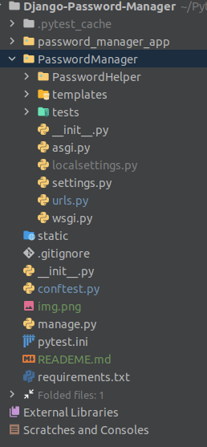

**Setup**

The first thing you need to do is clone the repository:

`$git clone git@github.com:KamilWardyla/Django-Password-Manager.git`

Next step you need to do is create a virtual environment:

`$python3 -m venv /path/to/new/virtual/environment`

Next step you need to do is activate virtual environment:

`$ source venv/bin/activate`

Then you need to install the dependencies:

`(venv)$ pip install -r requirements.txt`

Then you need to create file localsettings.py in PasswordManager folder as one the screenshot below



In the fallowing file must contain local settings such as:

*Your connection to the database

*Your encryption key - How to generate
key: [https://composed.blog/airflow/fernet-key](https://composed.blog/airflow/fernet-key)

*Your django core email backend configuration - How to configurate gmail as django core
email: [https://dev.to/abderrahmanemustapha/how-to-send-email-with-django-and-gmail-in-production-the-right-way-24ab](https://dev.to/abderrahmanemustapha/how-to-send-email-with-django-and-gmail-in-production-the-right-way-24ab)

```import os

DATABASES = {
    'default': {
        'HOST': 'YOUR HOSTNAME',
        'ENGINE': 'django.db.backends.postgresql_psycopg2',
        'NAME': 'NAME',
        'USER': 'USER',
        'PASSWORD': 'PASSWORD',
    }
}

FIELD_ENCRYPTION_KEY = os.environ.get('FIELD_ENCRYPTION_KEY', 'YOUR KEY')

EMAIL_BACKEND = 'django.core.mail.backends.smtp.EmailBackend'
EMAIL_HOST = "EMAIL_HOST"
EMAIL_PORT = 'EMAIL PORT'
EMAIL_USE_TLS = True
EMAIL_HOST_USER = "EMAIL_HOST_USER"
EMAIL_HOST_PASSWORD = "EMAIL_HOST_PASSWORD"
```

To run the application server:

`(venv)$ python manage.py makemigrations`

`(venv)$ python manage.py migrate`

`(venv)$ python manage.py runserver`


